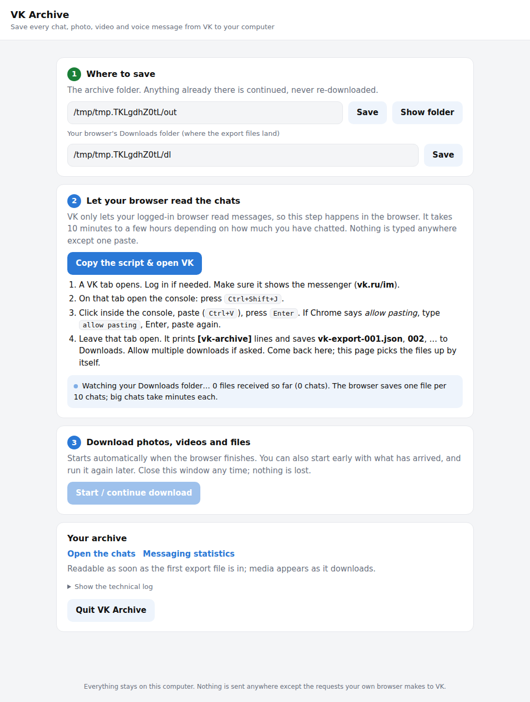

# VK Archive (vk-chat-archiver)

Offload **every** conversation from your VK (vk.com / vk.ru) account to disk: the full message
history plus all photos, videos, voice messages, documents, stickers and other attachments.
The result is a self-contained folder you can open in a browser years from now, with no VK
account needed.

- Zero dependencies, only Node.js 18+.
- Goes through every chat one by one until it runs out (private chats, group chats,
  community chats, archived chats).
- Resumable: stop it any time with Ctrl+C and re-run to continue; nothing is downloaded twice.
- Polite: stays under VK's rate limit and retries transient errors automatically.
- Output per chat: `messages.json` (raw API data), `messages.html` (browsable, works offline),
  `messages.txt` (plain text), and `media/` with the original files.
- `stats.html`: messaging statistics (who you talk to most, sent vs received, per year,
  time of day, streaks, attachments), computed from the archive, works offline.

## Why the API and not a Chrome extension?

A browser extension that scrolls through vk.com and scrapes the DOM is tempting because you
are already logged in, but it is the worse tool for this job:

- the web UI lazy-loads a few dozen messages at a time and virtualises the list, so the
  extension has to fight scrolling, timing and memory for chats with tens of thousands of messages;
- the DOM only shows resized thumbnails; the full-size photo, the video file and the voice
  message need extra requests anyway;
- VK changes its markup regularly, and every change breaks a scraper;
- a crash halfway means starting over.

The VK API gives you the same data as clean JSON with stable pagination, direct links to
full-size files, and a well-defined rate limit. The only hard part is getting a token that is
allowed to read messages, and that is a one-time, two-minute step described below.

## Beginner guide (no programming needed)

Everything happens on one page in your browser. No terminal, no typing, except one
paste into VK's page (VK only lets your logged-in browser read messages).

### Get it

- **Ready-made app (no Node.js needed):** download the ZIP for your computer from the
  [Releases](../../releases) page (or the latest build under "Actions"), unzip it.
- **Or from source:** click the green **Code** button → **Download ZIP**, unzip, and install
  Node.js once from https://nodejs.org (the "LTS" installer, click through).

### Start it

- **macOS:** double-click `VK Archive.app`. The first time macOS blocks it because it is
  not signed by Apple ("Apple could not verify ... is free of malware"): click **Done**,
  open **System Settings → Privacy & Security**, scroll down to the **Security** section,
  click **Open Anyway** next to the message, confirm with your password, and double-click
  the app again. This is needed once. On older macOS: right-click → **Open** → **Open**.
- **Windows:** double-click `VK Archive.bat`. If Windows says "Windows protected your PC",
  click **More info** → **Run anyway**. A small minimized window keeps the service running.

**If nothing happens when you open it** (no browser page, no window), the app now tells you
why instead of failing quietly: macOS opens a page in your browser with the reason and the
fix, Windows prints it in the black window. The full log is at
`~/Library/Logs/VK Archive.log` on macOS and `%LOCALAPPDATA%\VK Archive.log` on Windows.
The usual cause is the security block above. If macOS refuses to let the app start the
program itself, the app hands it over to a Terminal window instead, which works — keep that
window open while the archive runs. You can also clear the block by hand on macOS by pasting
this into Terminal once (use the folder you unzipped into):

```sh
xattr -dr com.apple.quarantine "/path/to/VK Archive.app"
```

Your browser opens the VK Archive page:



### Use it

1. **Where to save.** Press **Choose folder…** — the system's own folder window opens
   (macOS may put it behind the browser for a second), or type a path and press Enter.
   Nothing is created until you press **Use this folder**, and the page then shows exactly
   where it is saving. An external drive that is not plugged in is refused by name instead
   of quietly becoming a folder on your internal disk. Anything already in the folder is
   continued, never downloaded twice.
2. **Let your browser read the chats.** Click **Copy the script & open VK**. A VK tab opens;
   log in if needed. Open the browser console on that tab (the page shows the exact keys
   for your browser), paste, press Enter. Leave the tab open: it walks every chat, prints
   `[vk-archive]` progress lines and saves `vk-export-001.json`, `002`, … to Downloads.
   The VK Archive page notices each file by itself and shows how many chats have arrived.
3. **Download photos, videos and files.** Nothing starts on its own: press **Start
   download** when you are ready (you can start early with what has arrived). A progress
   bar shows chat X of N.
   This can take hours for a big account. Close the page or quit whenever you like and
   start the app again later: it continues where it stopped.
4. **Open the chats** and **Messaging statistics** links on the page show the result;
   the folder itself opens in any browser via `index.html`, and works forever without VK.

Prefer a terminal? `VK Archive (Terminal).command` on macOS runs the same flow as a
text conversation, and every step is also a command (see below).

### Speed, space and sleep

- **The download is slower than your internet.** VK limits each connection to roughly
  0.5-1 MB/s, so videos dominate the total time. VK Archive fetches several files at once
  and splits files over 16 MB across several byte-range connections, which multiplies the
  throughput when VK throttles per connection. The page's **Speed settings** change the
  video quality cap, how many files run at once, and how many connections each big file
  gets; from the terminal these are `--max-video-quality`, `--concurrency` and `--parallel`.
  Capping video at 720p is the single biggest saving: roughly a third of the bytes.
- **Keep the computer awake.** On macOS the app holds off sleep while downloading
  (`caffeinate`), but a closed lid still stops everything. On Windows set power settings
  to never sleep while plugged in. Progress is saved continuously, so sleeping only
  costs time.
- **Do not put the archive in iCloud Drive** (which includes Desktop and Documents on most
  Macs). Tens of thousands of small files are uploaded while being written, which is slow
  and can make a file briefly unreadable mid-run. Use a plain folder in your home directory
  or an external drive; moving the archive later and pointing the app at it works fine.

### If something goes wrong

- **The console prints an error instead of `[vk-archive]` lines.** Make sure you are on
  the messenger page (`/im`) of vk.ru or vk.com and logged in, then paste again.
- **The browser tab was closed halfway.** Open `browser-export.js`, set `startFrom:` at
  the top to the number the console printed, and paste it again; the page picks up the
  new files.
- **Nothing appears in Downloads.** Check the browser's download location and set it in
  step 1 of the page.
- **Advanced: token route.** The older way, an API token through the OAuth login of an
  official VK app, is still in the tool (`auth`, `whoami`, `diagnose`, `run`), but VK now
  often refuses such tokens with "Flood control". It is documented further down.

## Quick start (Terminal)

```bash
git clone <this repo> && cd vk_downloader_from_chats
node bin/vk-archive.js auth      # one-time: get a token (see below)
node bin/vk-archive.js whoami    # check the token works
node bin/vk-archive.js chats     # list what will be archived
node bin/vk-archive.js run       # archive everything into ./vk-archive
```

Token-free (what the launchers do):

```bash
node bin/vk-archive.js gui                     # the point-and-click page (default with no command)
node bin/vk-archive.js easy                    # the same flow as a terminal conversation
node bin/vk-archive.js easy --out ~/Desktop/VK --downloads ~/Downloads
# or the pieces by hand:
node bin/vk-archive.js browser                 # steps + script on the clipboard
node bin/vk-archive.js import ~/Downloads/vk-export-*.json
node bin/vk-archive.js run --offline
```

Optionally `npm link` to get a global `vk-archive` command.

## Getting a token (`vk-archive auth`)

VK does not grant the `messages` permission to ordinary third-party apps, so all VK export
tools log in through the OAuth implicit flow using the app id of an official client.
The default is Kate Mobile, which has worked reliably for years. You never type your
password anywhere except vk.com itself.

1. Run `node bin/vk-archive.js auth`. It prints a `https://oauth.vk.com/authorize?...` URL.
2. Open the URL in a browser where you are logged in to vk.com and confirm access.
3. The browser lands on a blank page whose address looks like
   `https://oauth.vk.com/blank.html#access_token=...&expires_in=0&user_id=...`.
   Copy the whole address and paste it into the terminal.
4. The token is saved to `~/.vk-archiver.json` (mode 600). You can also pass `--token`
   or set `VK_TOKEN` instead of saving it.

If Kate Mobile is refused, try `--app android`, `--app iphone`, `--app vkadmin` or any
`--app-id N`. If VK answers with a "validation required" page, complete it in the browser
and run `auth` again. Two-factor authentication works normally because the login happens
on vk.com.

### "[9] Flood control" or "[5] User authorization failed" right after logging in

VK answers this way when it dislikes the token itself, not the network. Run

```bash
node bin/vk-archive.js diagnose
```

It tries one `users.get` call per combination of host (`api.vk.ru` / `api.vk.com`),
API version and user agent, with no retries, and prints the flags that work
(for example `run --domain vk.ru --api-version 5.199 --no-user-agent`).
If every line says "Flood control": make sure no other Terminal window is still running
the tool, wait 15-30 minutes, and try again. If it still persists, get a token from
another official app (`auth --app android`, `--app iphone`, `--app vkme`, `--app vkadmin`),
or skip tokens altogether with the launcher / `easy` command described at the top.

The token can read everything in your account, so treat it like a password.
Revoke it afterwards at vk.com -> Settings -> Security -> Application access
(or just change your password).

## Running the archive

```bash
node bin/vk-archive.js run [options]

  --out DIR              output directory (default ./vk-archive)
  --domain vk.com|vk.ru  VK host to use (default vk.com, automatic fallback to the other)
  --peer ID[,ID...]      only these peers (user id, -group id, or 2000000000+chat id)
  --text-only            fetch history only, no media
  --no-video --no-photos --no-docs --no-voice --no-stickers --no-music
  --skip-groups          skip community conversations (newsletters, bots)
  --max-video-quality N  highest mp4 height to download (default 2160, e.g. 720)
  --concurrency N        files downloaded at the same time (default 4)
  --parallel N           connections per file over 16 MB (default 4)
  --retry-failed         retry media that previously failed with 403/404
  -v                     verbose logging
```

Suggested first pass on a big account:

```bash
node bin/vk-archive.js run --text-only          # all text first, fast (3 API calls/second, 200 messages each)
node bin/vk-archive.js run --no-video           # then photos, voice, docs, stickers
node bin/vk-archive.js run --max-video-quality 720   # then videos
```

In offline mode the readable pages for every chat are built first, before any media is
downloaded, so the archive is browsable within minutes; each chat's page is rebuilt once
its media is in.

Each run only adds what is missing: chats whose history is already complete are skipped,
and media that is already on disk is not downloaded again. To re-fetch one chat from
scratch (for example because new messages arrived), delete its `state.json` and
`messages.jsonl` and run again.

`node bin/vk-archive.js render` rebuilds the HTML/JSON/TXT from data already on disk
without any network access (useful after editing the templates).

`node bin/vk-archive.js stats` recomputes `stats.html` and `stats.json` from the archive
(also done automatically at the end of every run). It works as soon as the messages are
imported, before any media is downloaded.

`node bin/vk-archive.js import FILE...` loads `vk-export-*.json` files produced by
`browser-export.js` (the launcher flow) into the same layout, and `run --offline` then does the
media stage without a single API call. The two routes can be mixed: an imported chat is
simply a chat whose history is already complete.

## What you get

```
vk-archive/
  index.html                 list of all chats with counts and links
  stats.html, stats.json     messaging statistics
  conversations.json         raw conversation list
  names.json                 every user/community seen, with names
  me.json, summary.json
  user_12345_Ivan Petrov/
    messages.html            the chat, readable offline (light/dark)
    messages.json            {peer, participants, media index, messages[]} oldest first
    messages.txt             plain text transcript
    messages.jsonl           raw API messages as fetched, one per line (source of truth)
    media-index.json         what was downloaded where, and what failed and why
    state.json               progress bookkeeping
    videos-not-downloaded.txt  links to videos the API gives no file for (feed to yt-dlp)
    media/photos/2019-03-04_photo12345_678.jpg      file names start with the message date,
    media/videos/2019-03-04_video12345_678_720p.mp4  and each file's modification time is
    media/videos/2019-03-04_video12345_678_thumb.jpg set to that date too
    media/voice/2019-03-04_am12345_678.mp3
    media/docs/2019-03-04_doc12345_678_report.pdf
    media/stickers/, media/music/, media/other/
  chat_2000000123_Family/    group chats
  group_-9876_Some Public/   conversations with communities
```

Messages keep everything the API returns: forwarded messages (recursively), replies,
service actions (someone joined, chat renamed), edit times, geo, and all attachments.
Photos are downloaded at the largest available size. A photo forwarded ten times is stored once.

## Limitations and notes

- **Deleted conversations are gone.** The API only returns chats that still exist in your
  account. Chats you were kicked out of are listed but skipped (error 917).
- **Videos.** VK returns direct mp4 links for its own videos when the token comes from an
  official client (Kate Mobile does). Embedded YouTube/Rutube videos and HLS-only streams
  cannot be fetched directly; their links are written to `videos-not-downloaded.txt` and
  `yt-dlp -a videos-not-downloaded.txt` handles most of them.
- **Music.** Attached tracks are downloaded only when the API hands out a direct mp3 link;
  otherwise artist and title are recorded.
- **Expired attachments.** VK sometimes keeps a message but no longer serves its file
  (very old photos, files deleted by the sender). Those end up in `media-index.json` as
  `failed` with the HTTP status and are shown as "not downloaded" in the HTML.
- **Rate limits.** User tokens allow 3 requests per second. The tool stays just under it and
  backs off on "too many requests" and flood-control errors. A 100k-message account is
  roughly 500 history calls, i.e. a few minutes; media downloads dominate the total time.
- **Captcha.** If VK demands a captcha, the tool prints the image URL and waits for you to
  type the text.
- The official VK "Download your data" archive (Settings -> Privacy -> Request archive) is a
  decent second copy of the text but contains only links to media, not the files.

## Development

```bash
npm test               # unit tests + end-to-end runs against a local fake VK API (CLI, browser export, GUI)
npm run build:sea      # standalone executable for this OS into dist/ (Node 20+, esbuild + postject)
```

`.github/workflows/build.yml` runs the tests and builds the macOS (Apple Silicon, Intel)
and Windows packages on every push; pushing a tag `vX.Y` publishes them as a GitHub Release.
The binaries are ad-hoc signed only, hence the one-time "Open Anyway" / "Run anyway".

`test/fake-vk.js` implements just enough of `messages.getConversations`,
`messages.getHistory`, `video.get`, `users.get`, `groups.getById` and a file host to exercise
pagination, retries, every attachment type, 404s, and resumability. Point the CLI at it with
`VK_API_BASE=http://127.0.0.1:PORT/method/ VK_TOKEN=test-token`.
